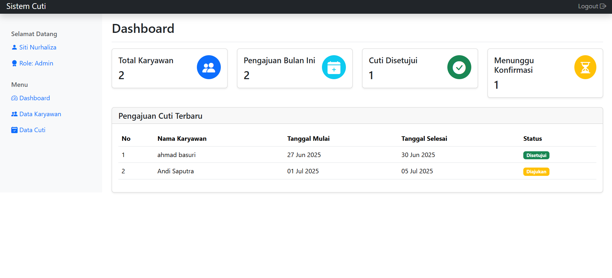
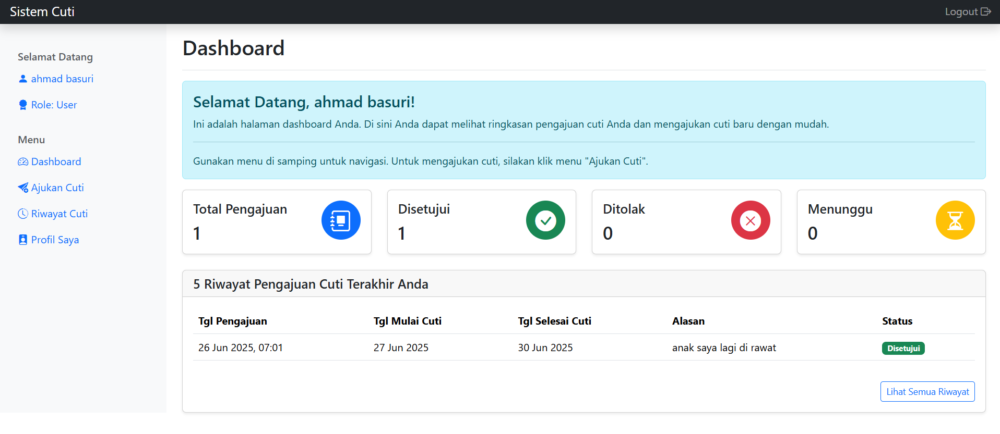

# 💼 Sistem Informasi Manajemen Cuti Karyawan (PHP Native)


Sistem Informasi Manajemen Cuti Karyawan adalah aplikasi web sederhana berbasis **PHP Native** (tanpa framework) yang dirancang untuk mengelola proses **pengajuan dan persetujuan cuti karyawan**. Aplikasi ini menggunakan **MySQL** sebagai basis data dan **Bootstrap 5** untuk antarmuka pengguna yang responsif.

Proyek ini cocok sebagai sarana pembelajaran bagi pemula yang ingin memahami pengembangan web dengan PHP tanpa framework.

---

## ✨ Kutipan

> *"Aku tidak berilmu; yang berilmu hanyalah DIA. Jika tampak ilmu dariku, itu hanyalah pantulan dari Cahaya-Nya."*




## ✨ Fitur Utama

Aplikasi memiliki dua role pengguna dengan hak akses berbeda:

### 👨‍💼 Admin
- **Dashboard**: Statistik karyawan dan cuti.
- **Manajemen Karyawan (CRUD)**: Tambah, ubah, hapus, dan lihat data karyawan.
- **Manajemen Pengajuan Cuti**: Verifikasi, detail, dan catatan pengajuan cuti.
- **Ekspor Data**: Ekspor data karyawan ke file Excel (`.xls`).

### 👩‍🔧 Karyawan (User)
- **Dashboard Pribadi**: Ringkasan pengajuan cuti.
- **Ajukan Cuti**: Isi dan kirim form cuti.
- **Riwayat Cuti**: Lihat histori & status pengajuan.
- **Manajemen Profil**: Edit data pribadi & ubah password.

---

## 🛠️ Teknologi yang Digunakan

| Komponen     | Teknologi        |
| ------------ | ---------------- |
| Backend      | PHP 8.x (Native) |
| Database     | MySQL / MariaDB  |
| Frontend     | HTML, CSS        |
| UI Framework | Bootstrap 5.3    |
| Icon Set     | Bootstrap Icons  |

---

## 📋 Spesifikasi Sistem

- Web Server: Apache (XAMPP / WAMP disarankan)
- PHP: Versi 8.0 atau lebih tinggi
- Database: MySQL / MariaDB
- Browser: Chrome, Firefox, atau browser modern lainnya

---

## 🚀 Panduan Instalasi


### 1. Unduh / Clone Proyek

Letakkan proyek di direktori `htdocs` milik XAMPP:

```bash
git clone https://github.com/Alghifari888/sistem_cuti_karyawan.git
cd sistem_cuti_karyawan
````

### 2. Buat Database

1. Buka `http://localhost/phpmyadmin`
2. Buat database baru bernama: `db_cuti_karyawan`
3. Jalankan skrip SQL berikut:

```sql
CREATE DATABASE IF NOT EXISTS db_cuti_karyawan;
USE db_cuti_karyawan;

CREATE TABLE `users` (
  `id` INT AUTO_INCREMENT PRIMARY KEY,
  `nik` CHAR(5) NOT NULL UNIQUE,
  `nama_lengkap` VARCHAR(100) NOT NULL,
  `jenis_kelamin` ENUM('L', 'P') NOT NULL,
  `alamat` TEXT,
  `jabatan` VARCHAR(50),
  `tanggal_bergabung` DATE,
  `password` VARCHAR(255) NOT NULL,
  `role` ENUM('admin', 'user') NOT NULL
) ENGINE=InnoDB;

CREATE TABLE `pengajuan_cuti` (
  `id` INT AUTO_INCREMENT PRIMARY KEY,
  `user_id` INT NOT NULL,
  `tanggal_mulai` DATE NOT NULL,
  `tanggal_selesai` DATE NOT NULL,
  `alasan` TEXT NOT NULL,
  `status` ENUM('Diajukan', 'Disetujui', 'Ditolak') NOT NULL DEFAULT 'Diajukan',
  `tanggal_pengajuan` TIMESTAMP DEFAULT CURRENT_TIMESTAMP,
  `catatan_admin` TEXT,
  FOREIGN KEY (`user_id`) REFERENCES `users`(`id`) ON DELETE CASCADE ON UPDATE CASCADE
) ENGINE=InnoDB;

-- Akun admin default
INSERT INTO `users` (`nik`, `nama_lengkap`, `jenis_kelamin`, `password`, `role`) VALUES
('admin', 'Administrator', 'L', '$2y$10$iCi.C.C9A141c2E5P7d3guU0YmJ9V/r0M8aO4doqKAjFz.a/zKP.S', 'admin');
```

### 3. Konfigurasi Database

Edit file `config/db.php`:

```php
$db_host = 'localhost';
$db_user = 'root';
$db_pass = ''; // default XAMPP
$db_name = 'db_cuti_karyawan';
```

### 4. Jalankan Aplikasi

1. Aktifkan Apache & MySQL dari XAMPP
2. Buka browser dan akses:

   ```
   http://localhost/sistem_cuti_karyawan/
   ```

### 5. Login Aplikasi

* **Admin**

  * NIK: `10002`
  * Password: `admin1234`
* **User**
* NIK: `10005`
* Password: `user123`  

* Tambahkan user manual via dashboard admin.

---

## 📁 Struktur Folder & File

```
cuti-karyawan/
├── auth/                 # Login, proses login, logout
├── config/               # Koneksi database
├── export/               # Ekspor Excel
├── layout/               # Template header, sidebar, footer
├── pages/                # Halaman utama (dashboard, cuti, profil)
├── proses/               # Proses CRUD dan validasi
└── index.php             # Entry point aplikasi
```

---

## 📣 Panduan Kontribusi

Kami sangat terbuka terhadap kontribusi! Ada dua cara untuk ikut berkontribusi:

---

### 🚀 A. Sebagai Kolaborator Langsung (Sudah Diundang)

Jika kamu **sudah diundang sebagai kolaborator**, ikuti langkah berikut:

#### 1. Clone repository

```bash
git clone https://github.com/Alghifari888/sistem_cuti_karyawan.git
cd sistem_cuti_karyawan
```

#### 2. Checkout ke branch `Views`

```bash
git checkout -b Views origin/Views
```

#### 3. Lakukan perubahan

```bash
git add .
git commit -m "Deskripsi perubahan"
```

#### 4. Push ke GitHub

```bash
git push origin Views
```

#### 5. (Opsional) Buka Pull Request ke `main`

👉 Konfirmasi terlebih dahulu ke pemilik repo (`Alghifari888`) sebelum PR.

#### 6. Sinkronisasi branch

```bash
git pull origin Views
```

#### 🖥️ Jalankan proyek secara lokal

Jika belum pernah setup:

1. Taruh folder di `C:/xampp/htdocs`
2. Buat database `db_cuti_karyawan`
3. Edit `config/db.php` sesuai lokal
4. Jalankan via browser:

   ```
   http://localhost/sistem_cuti_karyawan/
   ```

---

### 🪄 B. Melalui Fork (Jika Belum Jadi Kolaborator)

1. **Fork** repo ini ke akun GitHub kamu.
2. Clone hasil fork:

```bash
git clone https://github.com/USERNAME-KAMU/sistem_cuti_karyawan.git
cd sistem_cuti_karyawan
```

3. Buat branch fitur:

```bash
git checkout -b fitur-export-pdf
```

4. Lakukan perubahan → commit → push:

```bash
git add .
git commit -m "Tambah fitur export PDF"
git push origin fitur-export-pdf
```

5. Buka Pull Request ke branch `main` atau `Views` di repo asli.

---

## ✅ Pedoman Kontribusi

* Gunakan **branch terpisah** per fitur.
* Commit jelas & ringkas, contoh:

  * `fitur: Tambah export PDF`
  * `fix: Perbaikan validasi login`
* Selalu `git pull` sebelum `push`.
* Uji coba lokal sebelum PR.

---

## 📄 Contoh Alur Fork & PR

```bash
git clone https://github.com/USERNAME-KAMU/sistem_cuti_karyawan.git
cd sistem_cuti_karyawan
git checkout -b fitur-tampilan-baru
# lakukan perubahan
git add .
git commit -m "Tambah UI baru untuk tabel cuti"
git push origin fitur-tampilan-baru
```

Lalu buka PR ke `Alghifari888/sistem_cuti_karyawan`, pilih branch `Views` atau `main`.

Terima kasih telah berkontribusi! 🙌

## 📄 License (English)

This project is licensed under the MIT License.

Permission is hereby granted, free of charge, to any person obtaining a copy
of this software and associated documentation files (the "Software"), to deal
in the Software without restriction, including without limitation the rights
to use, copy, modify, merge, publish, distribute, sublicense, and/or sell
copies of the Software, subject to the following conditions:

The above copyright notice and this permission notice shall be included in all
copies or substantial portions of the Software.

THE SOFTWARE IS PROVIDED "AS IS", WITHOUT WARRANTY OF ANY KIND, EXPRESS OR
IMPLIED, INCLUDING BUT NOT LIMITED TO THE WARRANTIES OF MERCHANTABILITY,
FITNESS FOR A PARTICULAR PURPOSE AND NONINFRINGEMENT.

---

## 📄 Lisensi (Indonesia)

Proyek ini dilisensikan di bawah Lisensi MIT.

Hak Cipta (c) 2025 Alghifari888

Proyek ini menggunakan Lisensi MIT, yang berarti Anda bebas menggunakan, menyalin, mengubah, dan mendistribusikan perangkat lunak ini, termasuk untuk keperluan komersial, selama menyertakan pemberitahuan hak cipta dan lisensi asli.

Perangkat lunak ini disediakan apa adanya tanpa jaminan apa pun. Pengembang tidak bertanggung jawab atas kerusakan atau masalah yang timbul dari penggunaan perangkat lunak ini.


